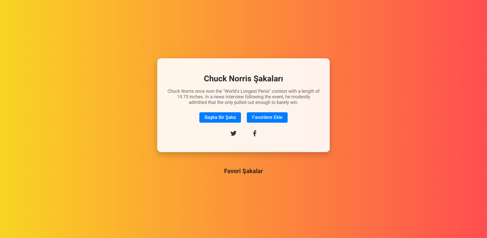
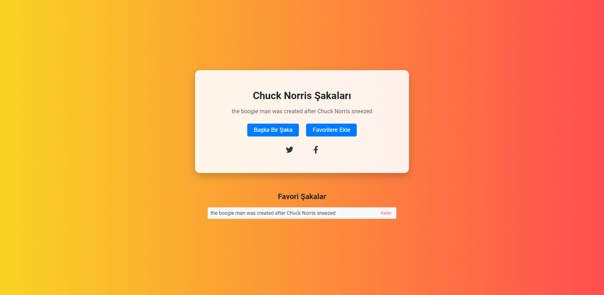

# Chuck Norris Jokes Website

## Overview
This project is an interactive web application dedicated to sharing jokes about the legendary Chuck Norris. The website fetches jokes from a public API and allows users to view, share, and save their favorite jokes for later viewing. Designed with a mobile-first approach, the site ensures a great user experience across all devices.

## Features
- **Dynamic Joke Loading**: Every time the page is refreshed or the "Another Joke" button is clicked, a new joke is fetched and displayed.
- **Favorites Management**: Users can save jokes to their favorites and view them anytime. They can also remove jokes from their favorites list.
- **Social Sharing**: Jokes can be shared directly to Twitter and Facebook using social media buttons.
- **Responsive Design**: The site is fully responsive, ensuring it adapts smoothly to any screen size, from mobile phones to desktops.

## Screenshots
The project includes screenshots that demonstrate the UI and functionality:
- 
- 

## Live Site
Experience the Chuck Norris Jokes website live at [Veccina Chuck Norris Jokes](https://veccina-chuck-norris-jokes.netlify.app).

## Local Development
To run this project locally, clone the repository and open the `index.html` file in a browser. Ensure that the internet connection is active as the application needs to fetch jokes from an online API.

## Technologies Used
- HTML
- CSS
- JavaScript
- Fetch API for fetching jokes from [Chuck Norris API](https://api.chucknorris.io/)

## Contributions
Contributions are welcome. Please fork the repository and submit a pull request with your enhancements.

## Acknowledgments
- Chuck Norris API for providing a vast collection of jokes.
- Font Awesome for the social media icons.
